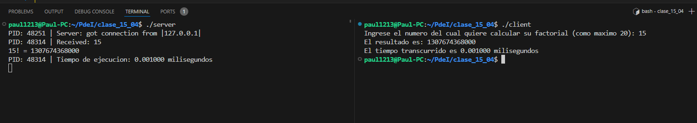
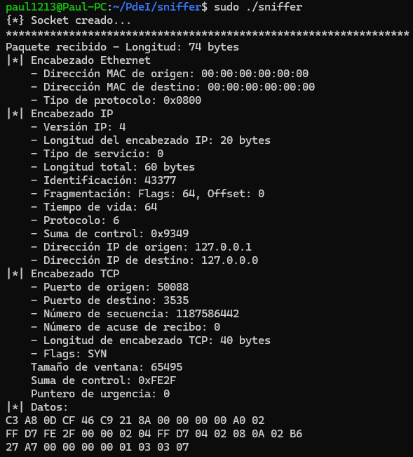
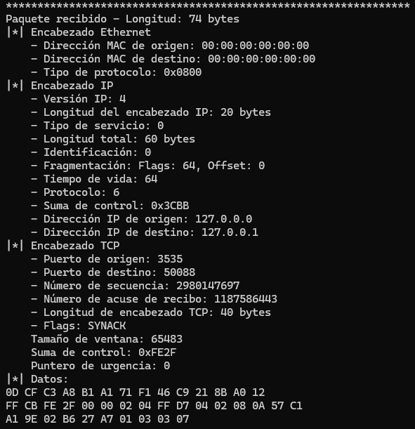
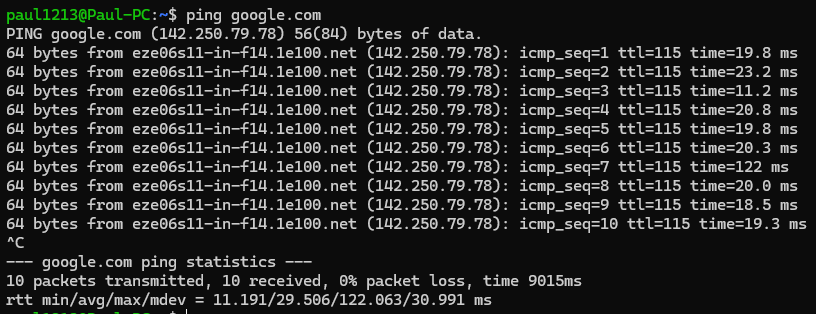

# PDI - TP 1 - B - Raw Sockets

En esta primera parte, lo que hicimos fue ejecutar el sniffer en una terminal. Agregamos una verificación para que solo se muestren los segmentos emitidos por o destinados al puerto 3535 y paquetes ICMP. De esta manera sólo se impirimen logs para segmentos enviados entre el cliente y el servidor o tráfico ICMP.

 

En otras dos terminales ejecutamos el modelo C-S hecho para el calculo de un factorial y la medición de los tiempos de cómputo con el siguiente output.

 

En la siguiente imágen, se observa la información del segmento enviado por el cliente.

 

En la siguiente imágen, se observa la información del segmento enviado por el servidor.

 

A continuación agregamos los logs producidos por el sniffer al capturar el tráfico producido al ejecutar <strong>ping google.com</strong> en otra terminal.

 

[Link a los logs](./log_sniffer_ICMP.txt)